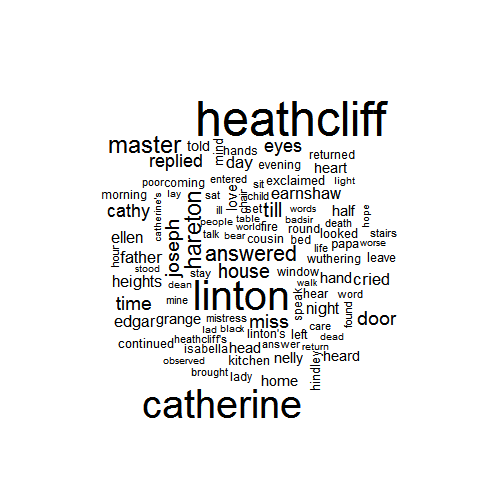

Exploring The Gutenberg Corpus
========================================================
author: Nick Cotter
date: 11/05/2018
autosize: true

The Gutenberg Corpus
========================================================


The Gutenberg Explorer Shiny app uses the techniques described in the book [Text Mining with R](https://www.tidytextmining.com/) to extract sentiment and word clouds from books in Project Gutenberg. 

We use three main R packages:
* **gutenbergr** to download books
* **tidytext** to turn text into a tidy format and extract sentiments
* **wordcloud** to build a word cloud

Let's get Wuthering Heights by its Gutenberg id:


```r
library(gutenbergr)
books <- gutenberg_download(768, meta_fields = "title")
```

Now turn this into a tidy data format (one row = one word):.


```r
tidy_books <- books %>%
  group_by(title) %>%
  mutate(linenumber = row_number(), chapter = cumsum(str_detect(text, regex("^chapter [\\divxlc]", ignore_case = TRUE)))) %>%
  ungroup() %>%
  unnest_tokens(word, text)
```


Sentiment Plot
========================================================

Use the **Bing** lexicon to create sentiments for groups of 80 lines of text:


```r
book_sentiment <- tidy_books %>% inner_join(get_sentiments("bing")) %>% count(title, index = linenumber %/% 80, sentiment) %>%
  spread(sentiment, n, fill = 0) %>%
  mutate(sentiment = positive - negative)
```

Plotting sentiment vs index shows the change from beginning to end of the book.

***


Word Cloud
========================================================

We can also show a word cloud: 


```r
library(wordcloud)

tidy_books %>%
  anti_join(stop_words) %>%
  count(word) %>%
  with(wordcloud(word, n, max.words = 100))
```

***



Links & Acknowledgements
=========================================================

The source code for the app is available here: https://github.com/nickcotter/dev-data-science-products-week-4

[Text Mining with R](https://www.tidytextmining.com/) is available to read online here: https://www.tidytextmining.com/
